# 📊 Diagramas de Flujo - Firmware ESP8266

> **Documento**: Diagramas visuales del comportamiento del firmware ESP8266
> **Formato**: Mermaid (compatible con GitHub, VSCode, herramientas de documentación)
> **Última actualización**: 2025-12-27

---

## Índice
1. [Flujo Principal del Sistema](#flujo-principal-del-sistema)
2. [Máquina de Estados de Conexión](#máquina-de-estados-de-conexión)
3. [Procesamiento de Comandos MQTT](#procesamiento-de-comandos-mqtt)
4. [Sincronización de Agendas](#sincronización-de-agendas)
5. [Ejecución de Agendas](#ejecución-de-agendas)
6. [Gestión de Relés con Timers](#gestión-de-relés-con-timers)
7. [Lectura y Publicación de Sensores](#lectura-y-publicación-de-sensores)
8. [Modo Offline y Reconexión](#modo-offline-y-reconexión)

---

## 1. Flujo Principal del Sistema

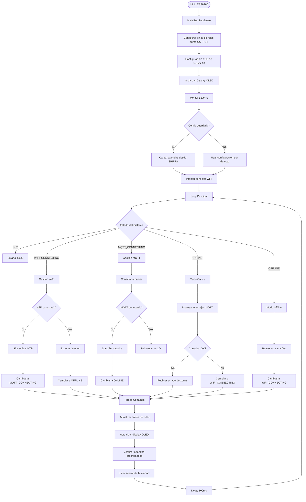

---

## 2. Máquina de Estados de Conexión

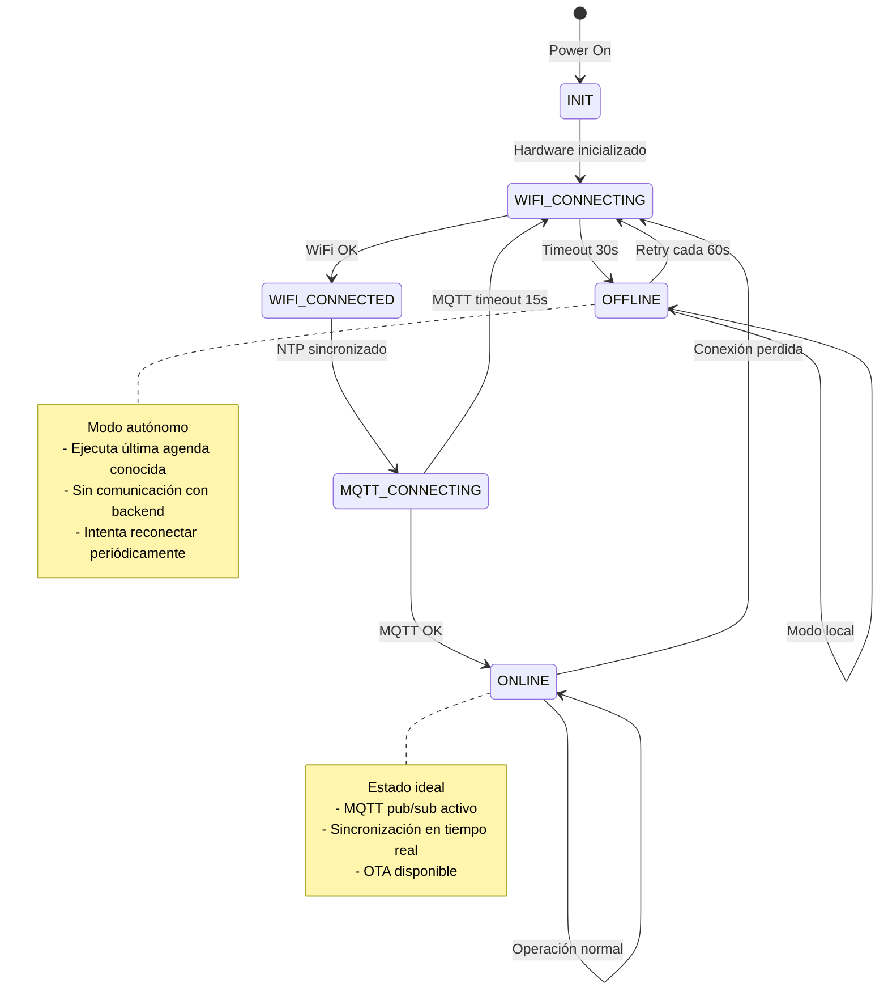

---

## 3. Procesamiento de Comandos MQTT

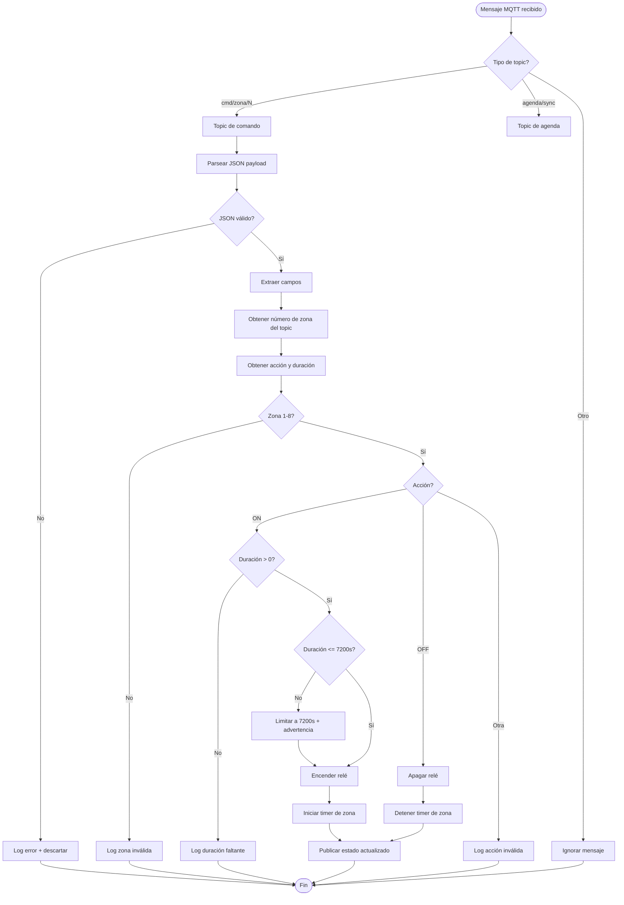

**Ejemplo de comando MQTT:**
```json
Topic: riego/550e8400-e29b-41d4-a716-446655440000/cmd/zona/1
Payload: {"accion": "ON", "duracion": 600}
```

---

## 4. Sincronización de Agendas

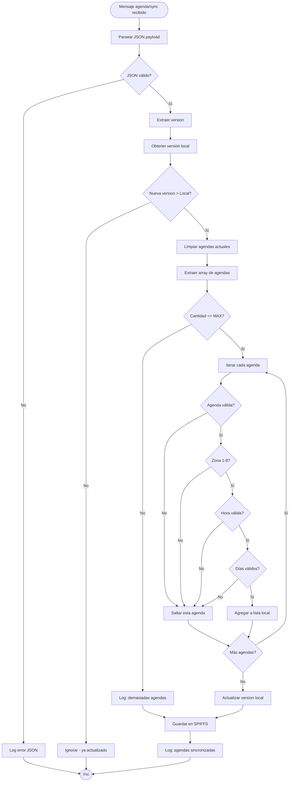

**Ejemplo de payload de sincronización:**
```json
{
  "version": 5,
  "agendas": [
    {
      "id": "uuid-1",
      "zona": 1,
      "nombre": "Césped mañana",
      "horaInicio": "07:30",
      "duracionMin": 15,
      "diasSemana": ["LUN", "MIE", "VIE"],
      "activa": true
    }
  ]
}
```

---

## 5. Ejecución de Agendas

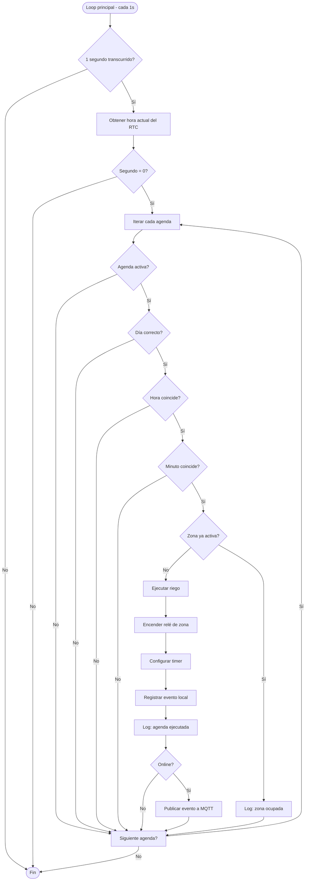

**Lógica de verificación de día:**
```cpp
// Mapeo: tm_wday (0=Dom) → índice agenda (0=Lun)
int dayIndex = (wday == 0) ? 6 : wday - 1;
return agenda.diasSemana[dayIndex];
```

---

## 6. Gestión de Relés con Timers

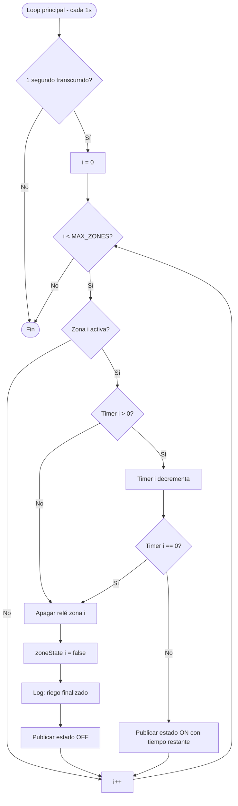

**Estructura de datos:**
```cpp
bool zoneState[MAX_ZONES];      // true = activa, false = inactiva
int zoneTimer[MAX_ZONES];       // segundos restantes
```

---

## 7. Lectura y Publicación de Sensores

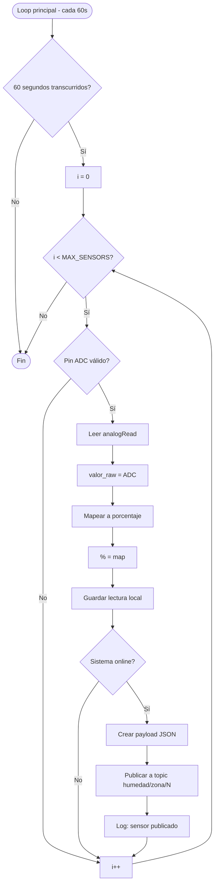

**Cálculo de porcentaje de humedad:**
```cpp
int raw = analogRead(pin);
int percentage = map(raw, SENSOR_DRY_VALUE, SENSOR_WET_VALUE, 0, 100);
percentage = constrain(percentage, 0, 100);
```

**Payload MQTT:**
```json
Topic: riego/{nodeId}/humedad/zona/1
Payload: {
  "zona": 1,
  "valor": 65,
  "raw": 1850,
  "timestamp": "2025-12-16T10:30:00Z"
}
```

---

## 8. Modo Offline y Reconexión

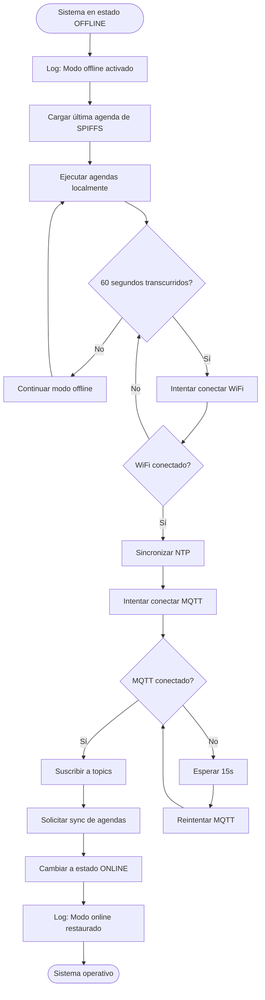

**Comportamiento en modo offline:**
- ✅ Ejecuta agendas guardadas localmente
- ✅ Controla relés normalmente
- ✅ Lee sensores (pero no publica)
- ❌ No recibe comandos remotos
- ❌ No sincroniza nuevas agendas
- 🔄 Intenta reconectar cada 60 segundos

---

## Diagrama de Arquitectura de Módulos

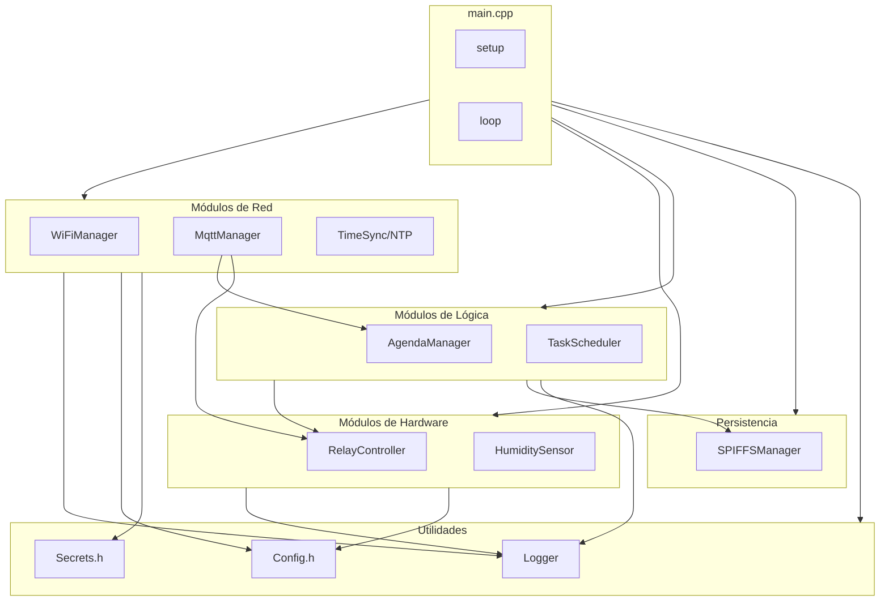

---

## Diagrama de Secuencia: Comando Manual

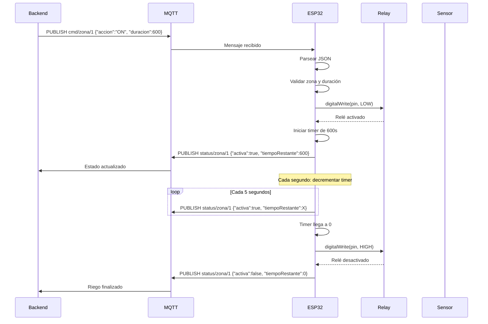

---

## Diagrama de Secuencia: Sincronización de Agenda

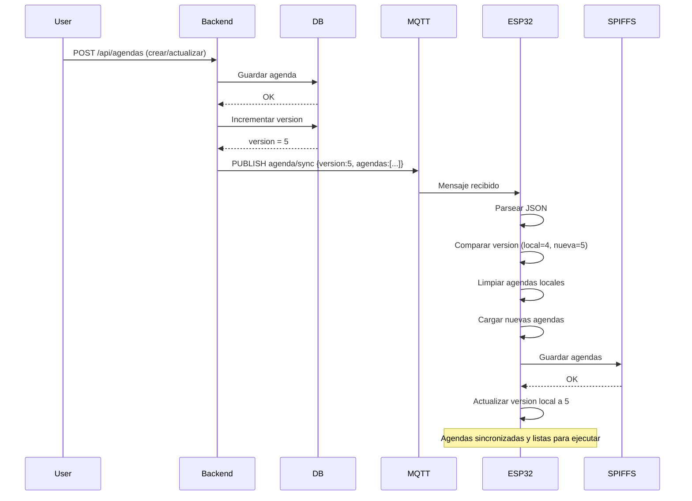

---

## Notas de Implementación

### Timings Críticos
- **Verificación de agendas**: Cada 1 segundo (solo ejecuta cuando segundo=0)
- **Actualización de timers**: Cada 1 segundo
- **Publicación de estado**: Cada 5 segundos (si online)
- **Lectura de sensores**: Cada 60 segundos
- **Reconexión WiFi**: Cada 30 segundos (si desconectado)
- **Reconexión MQTT**: Cada 15 segundos (si desconectado)
- **Retry modo offline**: Cada 60 segundos

### Consideraciones de Memoria
- **MAX_ZONES**: 8 zonas
- **MAX_AGENDAS**: ~20-30 agendas totales (limitado por RAM/SPIFFS)
- **SPIFFS**: Reservar mínimo 512KB para almacenamiento
- **JSON Buffer**: StaticJsonDocument<2048> para agendas
- **JSON Buffer**: StaticJsonDocument<256> para comandos/estado

### Watchdog Timer
- ESP32 tiene watchdog automático
- `delay(100)` en loop evita timeout
- No bloquear loop por más de 3-5 segundos

---

## Cómo Usar Estos Diagramas

### En VSCode
1. Instalar extensión: **Markdown Preview Mermaid Support**
2. Abrir este archivo `.md`
3. `Ctrl+Shift+V` para preview con diagramas renderizados

### En GitHub
- Los diagramas Mermaid se renderizan automáticamente
- Ver en: `docs/implementacion/esp32-diagramas-flujo.md`

### Exportar a Imagen
```bash
# Instalar mermaid-cli
npm install -g @mermaid-js/mermaid-cli

# Generar PNG
mmdc -i esp32-diagramas-flujo.md -o diagrama.png

# Generar SVG
mmdc -i esp32-diagramas-flujo.md -o diagrama.svg
```

### Editar Diagramas
- **Online**: https://mermaid.live/
- **Desktop**: https://www.diagram.codes/d/flowchart

---

## Próximos Pasos

1. Revisar [esp32-desarrollo.md](./esp32-desarrollo.md) para guía completa
2. Ver [esp32-diagramas-conexion.json](./esp32-diagramas-conexion.json) para hardware
3. Comenzar implementación del firmware siguiendo estos flujos
